<div align="center">

<!-- Christmas Zootopia Interactive Banner -->
<div style="position: relative; background: linear-gradient(135deg, #667eea 0%, #764ba2 100%); padding: 60px 20px; border-radius: 20px; overflow: hidden; box-shadow: 0 20px 60px rgba(0,0,0,0.3); margin-bottom: 30px;">
  
  <!-- Snowflakes Animation -->
  <style>
    @keyframes snowfall {
      0% { transform: translateY(-10px) translateX(0px); opacity: 1; }
      100% { transform: translateY(100vh) translateX(100px); opacity: 0; }
    }
    @keyframes twinkle {
      0%, 100% { opacity: 0.3; }
      50% { opacity: 1; }
    }
    @keyframes float {
      0%, 100% { transform: translateY(0px); }
      50% { transform: translateY(-20px); }
    }
    @keyframes glow {
      0%, 100% { filter: drop-shadow(0 0 5px rgba(255,255,255,0.5)); }
      50% { filter: drop-shadow(0 0 20px rgba(255,255,255,0.9)); }
    }
    .snowflake {
      position: absolute;
      top: -10px;
      color: white;
      font-size: 1.5em;
      animation: snowfall linear infinite;
      pointer-events: none;
      user-select: none;
    }
    .character-img {
      transition: all 0.3s ease;
      animation: float 3s ease-in-out infinite;
    }
    .character-img:hover {
      transform: scale(1.1) translateY(-10px);
      animation: glow 1.5s ease-in-out infinite;
    }
    .christmas-lights {
      position: absolute;
      top: 10px;
      left: 0;
      right: 0;
      height: 20px;
      background: repeating-linear-gradient(
        90deg,
        #ff0000 0px, #ff0000 20px,
        #00ff00 20px, #00ff00 40px,
        #ffff00 40px, #ffff00 60px,
        #0000ff 60px, #0000ff 80px
      );
      opacity: 0.6;
      animation: twinkle 2s ease-in-out infinite;
    }
    .banner-title {
      color: white;
      text-shadow: 0 0 20px rgba(255,255,255,0.5), 0 0 40px rgba(147,51,234,0.5);
      margin: 20px 0;
      font-size: 3em;
      font-weight: bold;
    }
    .banner-subtitle {
      color: #e0e7ff;
      font-size: 1.3em;
      margin-bottom: 20px;
      text-shadow: 0 2px 4px rgba(0,0,0,0.3);
    }
  </style>
  
  <!-- Christmas Lights -->
  <div class="christmas-lights"></div>
  
  <!-- Snowflakes -->
  <div class="snowflake" style="left: 10%; animation-duration: 10s; animation-delay: 0s;">❄</div>
  <div class="snowflake" style="left: 20%; animation-duration: 12s; animation-delay: 2s;">❅</div>
  <div class="snowflake" style="left: 30%; animation-duration: 15s; animation-delay: 4s;">❆</div>
  <div class="snowflake" style="left: 40%; animation-duration: 11s; animation-delay: 1s;">❄</div>
  <div class="snowflake" style="left: 50%; animation-duration: 13s; animation-delay: 3s;">❅</div>
  <div class="snowflake" style="left: 60%; animation-duration: 14s; animation-delay: 5s;">❆</div>
  <div class="snowflake" style="left: 70%; animation-duration: 10s; animation-delay: 2s;">❄</div>
  <div class="snowflake" style="left: 80%; animation-duration: 12s; animation-delay: 4s;">❅</div>
  <div class="snowflake" style="left: 90%; animation-duration: 11s; animation-delay: 1s;">❆</div>
  
  <!-- Character Images and Title -->
  <div style="display: flex; align-items: center; justify-content: center; gap: 40px; position: relative; z-index: 10; flex-wrap: wrap;">
    
    <!-- Judy Hopps -->
    
    
    <!-- Center Title -->
    <div style="text-align: center; max-width: 500px;">
      <h1 class="banner-title">🎬 Threads Content Collector</h1>
      <p class="banner-subtitle">✨ Your Personal Disney & Zootopia Archive ✨</p>
      <p style="color: #fef3c7; font-size: 0.9em; margin-top: 10px;">🎄 Merry Christmas from Zootopia! ❄️</p>
    </div>
    
    <!-- Nick Wilde -->
    
    
  </div>
  
  <!-- Badges -->
  <div style="margin-top: 30px; position: relative; z-index: 10;">
    <a href="https://www.python.org/downloads/"></a>
    <a href="LICENSE"></a>
    
    
  </div>
  
  <!-- Navigation -->
  <div style="margin-top: 20px; color: white; position: relative; z-index: 10;">
    <a href="README.zh.md" style="color: #fef3c7; text-decoration: none; margin: 0 10px;">🌏 繁體中文</a> | 
    <strong>English</strong> | 
    <a href="#-documentation" style="color: #fef3c7; text-decoration: none; margin: 0 10px;">📚 Documentation Portal</a>
  </div>
  
  <!-- Tagline -->
  <p style="color: #e0e7ff; margin-top: 20px; font-style: italic; position: relative; z-index: 10;">
    Collect, organize, and archive your favorite Threads posts about Disney, Zootopia, recipes, and more!
  </p>

</div>

</div>

---

## ✨ What Is This?

A **hobby archival toolkit** for Disney fans and content collectors! If you love Zootopia characters, animation discussions, themed recipes, or fan communities, this helps you:

- 🔍 **Search & Save** - Find posts about Judy Hopps, Nick Wilde, and your favorite topics
- 🤖 **AI Organization** - Smart sorting helps identify the best matches for your collection
- 💾 **Local Archive** - Everything saved privately on your computer
- 🎨 **Media Included** - Downloads photos, videos, and attachments automatically

---

## 🎯 Perfect For

| Interest | Examples |
|----------|----------|
| 🦊 **Disney Characters** | Zootopia, Judy Hopps, Nick Wilde, character analysis |
| 🎨 **Fan Content** | Cosplay builds, fan art, creative projects |
| 🍳 **Themed Recipes** | Pawpsicles, Disney-inspired treats, park food recreations |
| 🎬 **Animation** | Behind-the-scenes, technique discussions, industry news |
| 🏰 **Parks & Merch** | Disney experiences, collectibles, attraction updates |

---

## 📰 Recent Updates

<details open>
<summary><b>🚀 Version 1.0 - December 2025</b></summary>

- ✅ **Smart AI Classifier** - Local LLM integration for intelligent content sorting
- ✅ **GPU Acceleration** - Multi-threaded processing for bulk collections (100+ posts/min)
- ✅ **Resume Capability** - Checkpoint system lets you pause and continue anytime
- ✅ **Bilingual Support** - Interface available in English and Traditional Chinese (繁體中文)
- ✅ **Vision Analysis** - Optional image/video content verification
- ✅ **False Positive Detection** - Smart context understanding (e.g., "Judy" the person vs. character)

</details>

<details>
<summary><b>🎨 What Makes This Special</b></summary>

Unlike generic scrapers, this tool:
- **Understands context** - Knows "Nick Wilde" isn't just any Nick
- **Privacy-focused** - Everything processes locally, no cloud uploads
- **Hobby-oriented** - Designed for personal collections, not commercial use
- **Community-friendly** - Respects rate limits and platform guidelines

</details>

---

## 📚 Documentation

<table>
<tr>
<td width="50%" valign="top">

### 🚀 **Quick Start Guides**

- [**Quick Reference Card**](QUICK_REFERENCE.md)  
  *3-command setup, cheat sheet, examples*

- [**Model Setup Guide**](MODEL_SETUP_README.md)  
  *AI classifier setup in 3 steps*

- [**Setup Script**](setup_model.ps1)  
  *Automated one-click setup*

</td>
<td width="50%" valign="top">

### 📖 **Detailed Documentation**

- [**Complete Modelfile Guide**](MODELFILE_GUIDE.md)  
  *Advanced configuration, troubleshooting, optimization*

- [**Testing Suite**](test_classifier.py)  
  *12-test validation for accuracy*

- [**繁體中文版**](README.zh.md)  
  *Traditional Chinese documentation*

</td>
</tr>
</table>

---

## ⚡ Quick Start

<details>
<summary><b>Step 1: Installation (Click to expand)</b></summary>

### Prerequisites
- Python 3.8 or higher
- Threads account for authentication
- GPU recommended (optional, but 6x faster)

### Platform-Specific Setup

**🐧 Linux**
```bash
git clone https://github.com/jyusiwong/Threads-Archiver.git
cd Threads-Archiver

apt update && apt install -y libgconf-2-4 libatk1.0-0 libgbm-dev \
  libnotify-dev libgdk-pixbuf2.0-0 libnss3 libxss1 libasound2 \
  libxtst6 xdg-utils

pip install -r requirements.txt
playwright install chromium
```

**🍎 macOS**
```bash
git clone https://github.com/jyusiwong/Threads-Archiver.git
cd Threads-Archiver

xcode-select --install
pip install -r requirements.txt
playwright install chromium
```

**🪟 Windows**
```powershell
git clone https://github.com/jyusiwong/Threads-Archiver.git
cd Threads-Archiver

pip install -r requirements.txt
playwright install chromium
```

</details>

<details>
<summary><b>Step 2: Collect Your First Posts</b></summary>

### Phase 1: Search & Download
```bash
python phase1_search_download.py
```

**What happens:**
1. Opens browser for Threads login (one-time)
2. Searches for your topics (Judy Hopps, recipes, etc.)
3. Scrolls through results automatically
4. Downloads posts + media to your computer
5. Saves in organized JSONL format

**Configure your interests** in the script:
```python
TOPICS = ["Judy Hopps", "Nick Wilde", "Zootopia fan art", "Disney recipes"]
POST_LIMIT = 2000  # Max posts per topic
```

</details>

<details>
<summary><b>Step 3: AI-Powered Organization (Optional)</b></summary>

### Phase 2: Smart Sorting

**First time setup:**
```powershell
.\setup_model.ps1          # Creates AI classifier
python test_classifier.py  # Validates accuracy
```

**Run the sorter:**
```bash
python phase2_ai_prefilter.py              # Single-threaded
# OR
python phase2_ai_prefilter_multithreaded.py  # 6x faster (GPU)
```

**Results:**
- `_sorting/[topic]_posts_likely_yes.jsonl` - Matches your interests ✅
- `_sorting/[topic]_posts_uncertain.jsonl` - Review these ⚠️
- `_sorting/[topic]_posts_likely_no.jsonl` - Probably skip ❌

</details>

---

## 🎨 How It Works

```mermaid
%%{init: {'theme':'base', 'themeVariables': { 'primaryColor':'#e3f2fd','primaryTextColor':'#0d47a1','primaryBorderColor':'#1976d2','lineColor':'#42a5f5','secondaryColor':'#fff3e0','tertiaryColor':'#f3e5f5','noteBkgColor':'#e8f5e9','noteTextColor':'#1b5e20'}}}%%
graph TB
    Start(["🎬 Start Your Collection Journey"])
    Search["🔍 Search Topics<br/><small>Judy Hopps, Nick Wilde, etc.</small>"]
    Download["📥 Download Posts<br/><small>Text + Images + Videos</small>"]
    Save["💾 Save Locally<br/><small>JSONL Format</small>"]
    AIDecision{"🤖 Enable AI Sorting?<br/><small>Optional but Recommended</small>"}
    
    AIProcess["⚡ AI Analysis<br/><small>Context Understanding</small>"]
    
    Relevant["✅ Highly Relevant<br/><small>Matches Your Interest</small>"]
    Uncertain["⚠️ Uncertain<br/><small>Needs Review</small>"]
    NotRelevant["❌ Not Relevant<br/><small>Low Match Score</small>"]
    RawArchive["📁 Raw Archive<br/><small>All Posts Unsorted</small>"]
    
    End(["🎉 Collection Complete!"])
    
    Start ==> Search
    Search ==> Download
    Download ==> Save
    Save ==> AIDecision
    
    AIDecision -->|"Yes 👍"| AIProcess
    AIDecision -->|"No 👎"| RawArchive
    
    AIProcess ==> Relevant
    AIProcess ==> Uncertain
    AIProcess ==> NotRelevant
    
    Relevant ==> End
    Uncertain ==> End
    NotRelevant ==> End
    RawArchive ==> End
    
    style Start fill:#e1f5ff,stroke:#01579b,stroke-width:3px,color:#01579b
    style Search fill:#e8f5e9,stroke:#2e7d32,stroke-width:2px,color:#1b5e20
    style Download fill:#fff3e0,stroke:#e65100,stroke-width:2px,color:#e65100
    style Save fill:#f3e5f5,stroke:#6a1b9a,stroke-width:2px,color:#4a148c
    style AIDecision fill:#fff9c4,stroke:#f57f17,stroke-width:3px,color:#f57f17
    style AIProcess fill:#e0f2f1,stroke:#00695c,stroke-width:2px,color:#004d40
    style Relevant fill:#c8e6c9,stroke:#388e3c,stroke-width:3px,color:#1b5e20
    style Uncertain fill:#ffe0b2,stroke:#ef6c00,stroke-width:2px,color:#e65100
    style NotRelevant fill:#ffcdd2,stroke:#c62828,stroke-width:2px,color:#b71c1c
    style RawArchive fill:#e1bee7,stroke:#7b1fa2,stroke-width:2px,color:#4a148c
    style End fill:#b2ebf2,stroke:#006064,stroke-width:3px,color:#006064
    
    classDef processNode fill:#e3f2fd,stroke:#1976d2,stroke-width:2px,color:#0d47a1
    classDef resultNode fill:#f1f8e9,stroke:#689f38,stroke-width:2px,color:#33691e
```

<div align="center">



</div>

### Two-Phase Workflow

| Phase | Purpose | Output |
|-------|---------|--------|
| **Phase 1** | Collection | Raw posts + media in `Interested_Event_Archive/` |
| **Phase 2** | Organization | Sorted posts in `_sorting/` by relevance |

---

## ⚙️ Configuration

### Customize Your Interests

```python
# phase1_search_download.py - What to collect
class Config:
    TOPICS = [
        "Judy Hopps",           # Zootopia character
        "Nick Wilde",           # Another favorite
        "Disney recipes",       # Themed cooking
        "Zootopia fan art"      # Creative content
    ]
    POST_LIMIT = 2000          # Posts per topic
    SCROLL_DELAY = 3           # Seconds between scrolls

# phase2_ai_prefilter.py - How to sort
class AppConfig:
    MODEL_NAME = "disney-classifier"     # AI model to use
    HIGH_CONFIDENCE = 0.7               # Threshold for "yes"
    LOW_CONFIDENCE = 0.3                # Threshold for "no"
    GPU_ACTIVE = True                   # Use GPU acceleration
```

---

## 📁 Project Structure

```
Threads-Archiver/
│
├── 📝 Core Scripts
│   ├── phase1_search_download.py          # Search & download posts
│   ├── phase2_ai_prefilter.py             # AI sorting (single-thread)
│   └── phase2_ai_prefilter_multithreaded.py  # AI sorting (parallel)
│
├── 🤖 AI Configuration
│   ├── Modelfile                          # Custom AI model definition
│   ├── setup_model.ps1                    # Automated setup script
│   └── test_classifier.py                 # Validation test suite
│
├── 📚 Documentation
│   ├── README.md                          # This file
│   ├── README.zh.md                       # 繁體中文版本
│   ├── QUICK_REFERENCE.md                 # Quick start guide
│   ├── MODEL_SETUP_README.md              # AI setup tutorial
│   └── MODELFILE_GUIDE.md                 # Advanced configuration
│
├── 💾 Data Directories
│   ├── Interested_Event_Archive/          # Your collected posts & media
│   ├── thread_sessions/                   # Login sessions (local only)
│   └── _sorting/                          # AI-organized outputs
│       ├── checkpoints/                   # Resume points
│       ├── *_posts_likely_yes.jsonl       # High relevance ✅
│       ├── *_posts_uncertain.jsonl        # Review needed ⚠️
│       └── *_posts_likely_no.jsonl        # Low relevance ❌
│
└── ⚙️ Configuration
    └── requirements.txt                   # Python dependencies
```

---

## 🌟 Use Cases

### ✅ Great For:
- 🎨 Building personal Disney character collections
- 📖 Archiving fan discussions and theories
- 🍳 Saving themed recipe posts for later
- 🎓 Learning about AI and data organization
- 💝 Creating curated content libraries for hobbies

### ❌ Not For:
- 💼 Commercial data harvesting
- 🔓 Violating privacy or platform ToS
- 📊 Large-scale analytics or research
- 💰 Any for-profit activities

---

## 🛡️ Responsible Use

This is a **personal hobby tool**. Please:

- ✅ Follow local laws and platform guidelines
- ✅ Respect content creators' rights
- ✅ Keep data private and secure
- ✅ Use for personal, non-commercial purposes
- ✅ Be mindful of rate limits and server load

---

## 🤝 Contributing

Found a bug? Have a feature idea? Contributions welcome!

1. 🍴 Fork the repository
2. 🌿 Create a feature branch (`git checkout -b feature/AmazingFeature`)
3. 💾 Commit your changes (`git commit -m 'Add some AmazingFeature'`)
4. 📤 Push to the branch (`git push origin feature/AmazingFeature`)
5. 🔃 Open a Pull Request

---

## 📄 License

**MIT License** - See [LICENSE](LICENSE) for details.

**In Short:**
- ✅ Use for personal projects
- ✅ Modify as you like
- ✅ Share with others
- ⚠️ Include original license notice
- ⚠️ No warranty provided

---

<div align="center">

### 🎬 Made with ❤️ for Disney Fans

*Collect what you love. Organize what matters. Archive your passion.*

**[⬆️ Back to Top](#-threads-content-collector)**

---

🦊 **Happy Collecting!** | 🐰 **Enjoy Your Archive!** | 🎨 **Share Your Passion!**

</div>
